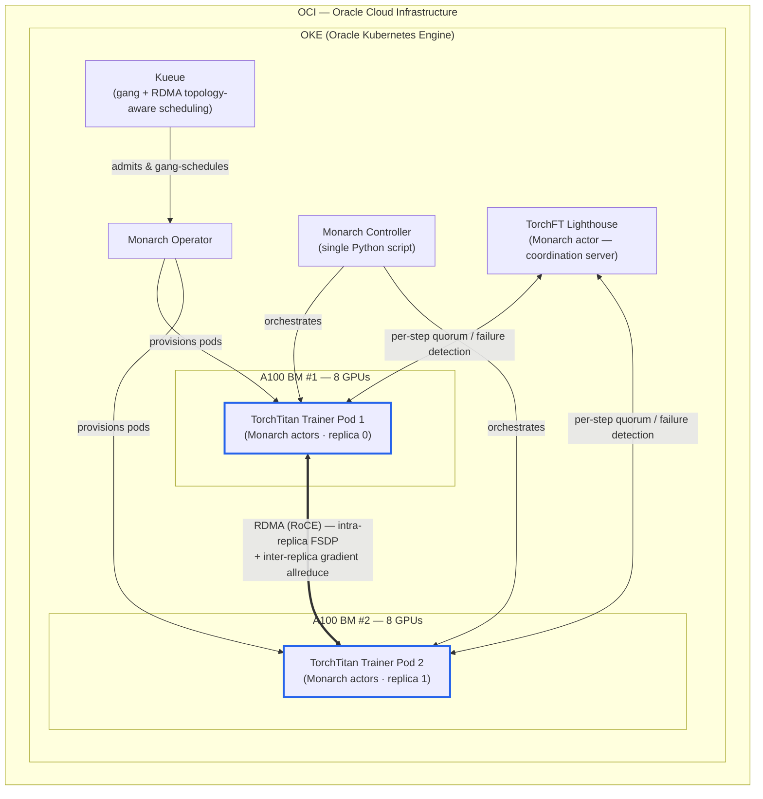

# Building a Fault-Tolerant, RDMA-Topology-Aware Training System with PyTorch Monarch, TorchFT, and TorchTitan on OKE

Training large models is hard. Training them *reliably* on a shared GPU cluster — where a single bad NIC, a flaky node, or a noisy neighbor can erase hours of progress — is harder. In this post, we'll walk through how we're building a training system on **Oracle Kubernetes Engine (OKE)** that:

- orchestrates multi-node PyTorch jobs from a single controller,
- is aware of the cluster's RDMA topology so collective traffic stays on the fast lane,
- and survives mid-run failures without restarting from scratch.

We'll get there step by step. Each step is a small, testable change to the system, and each one has real numbers from our cluster behind it.

---

## 1. The building blocks

Before we touch any code, here's a quick tour of the pieces we're combining.

### OKE (Oracle Kubernetes Engine)

[OKE](https://docs.oracle.com/en-us/iaas/Content/ContEng/home.htm) is Oracle Cloud's managed Kubernetes service — the foundation everything else runs on: pods, jobs, the operator that schedules Monarch workers, and the RDMA configuration.

For these experiments we use a small but representative cluster:

> **2 × A100 bare-metal nodes, 16 GPUs total, with RDMA-capable inter-node networking.**

Two nodes is the smallest configuration where multi-node networking, gang scheduling, and topology awareness actually matter.

### PyTorch Monarch

[PyTorch Monarch](https://github.com/meta-pytorch/monarch) is Meta's distributed orchestration framework for PyTorch. Instead of a `torchrun` wrapper, a Helm chart, *and* an operator config, you write **one Python controller script** describing the job — how many hosts, GPUs per host, and what runs on each rank — and Monarch handles the rest.

Two things matter for us:

1. **It runs on Kubernetes (and Slurm).** We use the [Monarch Operator](https://github.com/meta-pytorch/monarch-kubernetes) on OKE, but the same script ports to Slurm by swapping just the pod-spec helper for a Slurm allocator helper — the model code, actors, and training loop stay identical.
2. **It's a single point of orchestration.** Failures, resizing, and restarts all flow through the same controller — exactly what we need before layering fault tolerance on top.

### TorchTitan

[TorchTitan](https://github.com/pytorch/torchtitan) is PyTorch's reference implementation for training large models. It bundles FSDP, tensor/pipeline parallelism, and activation checkpointing behind a clean config system, letting us focus on the *system* (orchestration, RDMA, failure handling) instead of the model-parallelism strategy.

### TorchFT

[TorchFT](https://github.com/pytorch/torchft) is PyTorch's fault-tolerance library. The headline idea is **per-step fault tolerance**: when a replica dies, the survivors keep training without restarting, and the dead replica rejoins later. It works via a coordination server called the **Lighthouse**, plus runtime wrappers around DDP and the optimizer. Monarch orchestrates; TorchFT handles "what happens when something dies mid-step."

### Kueue

[Kueue](https://kueue.sigs.k8s.io/) is a Kubernetes-native job queue. We bring it in for two specific capabilities:

- **Gang scheduling** — all pods of a multi-node job start together or not at all. No more half-scheduled jobs holding GPUs hostage.
- **RDMA topology-aware scheduling** — Kueue can place pods so their RDMA NICs share the fewest possible switch hops, which is critical for collective performance.

We'll show topology awareness paying off later in the article.

---

## 2. The evaluation model

To compare each step apples-to-apples, we train the same model every time:

> **Llama 3 — 8B parameters, trained on the C4 dataset.**

This isn't about producing a state-of-the-art checkpoint — it's about validating the *system*. Llama 3 8B is large enough to be realistic, small enough to iterate on quickly, and well-understood enough that the metrics tell a clear story.

---

## 3. Construction

We build the system **incrementally** — start simple, measure, then add one component at a time. Each configuration below links to its own branch with a detailed write-up.

### [3.1 The baseline — OKE + TorchTitan + `torchrun`](https://github.com/oci-ai-incubations/monarch-recipe-bp/blob/cfg1_oke_torchtitan_torchrun/examples/k8s_titan_torchft_non_monarch/README.md)

### [3.2 Adding Monarch — one controller to orchestrate them all](https://github.com/oci-ai-incubations/monarch-recipe-bp/blob/cfg2_oke_torchtitan_monarch/examples/k8s_titan_torchft_monarch/README.md)

### [3.3 Adding TorchFT — surviving the failures that *will* happen](https://github.com/oci-ai-incubations/monarch-recipe-bp/blob/cfg3_oke_torchtitan_monarch_torchft/examples/k8s_titan_torchft_monarch/README.md)

### [3.4 Adding RDMA — paying off the TorchFT bill](https://github.com/oci-ai-incubations/monarch-recipe-bp/blob/cfg4_oke_torchtitan_monarch_torchft_rdma/examples/k8s_titan_torchft_monarch/README.md)

### [3.5 RDMA Topology-Aware Scheduling and Gang Scheduling](https://github.com/oci-ai-incubations/monarch-recipe-bp/blob/cfg5_oke_torchtitan_monarch_torchft_rdma_kueue/examples/k8s_titan_torchft_monarch/README.md)

### Results

All runs train Llama 3 8B on C4 for **1000 steps** on **2 × A100 BM (16 GPUs)**

| Config | Time | Loss | Status | MFU | TPS | TFLOPs | Grad Norm | Memory |
|---|---|---|---|---|---|---|---|---|
| [3.1](https://github.com/oci-ai-incubations/monarch-recipe-bp/blob/cfg1_oke_torchtitan_torchrun/examples/k8s_titan_torchft_non_monarch/README.md) torchrun baseline | 2473 s | 12.24577 → 4.64120 | Success | **55.34%** | 3355 | 172.68 | 1.0655 | 50.26 GiB |
| [3.2](https://github.com/oci-ai-incubations/monarch-recipe-bp/blob/cfg2_oke_torchtitan_monarch/examples/k8s_titan_torchft_monarch/README.md) + Monarch | 2505 s | 12.26616 → 4.64640 | Success | **55.49%** | 3364 | 173.13 | 1.0923 | 50.26 GiB |
| [3.3](https://github.com/oci-ai-incubations/monarch-recipe-bp/blob/cfg3_oke_torchtitan_monarch_torchft/examples/k8s_titan_torchft_monarch/README.md) + TorchFT (TCP overlay) | 6389 s | 12.24841 → 4.65391 | Success | **21.46%** | 1301 | 66.97 | 1.2422 | 55.12 GiB |
| [3.4](https://github.com/oci-ai-incubations/monarch-recipe-bp/blob/cfg4_oke_torchtitan_monarch_torchft_rdma/examples/k8s_titan_torchft_monarch/README.md) + RDMA (RoCE) | 2566 s | 12.23993 → 4.30832 | Success | **54.25%** | 3288 | 169.25 | 0.9664 | 55.12 GiB |
| [3.5](https://github.com/oci-ai-incubations/monarch-recipe-bp/blob/cfg5_oke_torchtitan_monarch_torchft_rdma_kueue/examples/k8s_titan_torchft_monarch/README.md) + Kueue | same as 3.4 | same as 3.4 | Success | — | — | — | — | — |

> **Note on 3.3:** TorchFT buys per-step fault tolerance but is ~2.5× slower — its cross-replica gradient allreduce runs over the slow TCP/IP pod overlay instead of RDMA.

> **Note on 3.4:** Moving that allreduce onto the RDMA fabric (RoCE) erases the 3.3 slowdown, back to baseline throughput with fault tolerance kept.

> **Note on 3.5:** Kueue adds gang scheduling and RDMA topology-aware admission. It is invisible during steady-state training — it changes how jobs *land* on and *share* the cluster, not the training math or per-step wall-clock — so its throughput metrics match 3.4.

### Architecture Diagram

Here's what the running system looks like end-to-end (*the final configuration 3.5*):

**How the layers stack:**

- **OCI + OKE** — the base cloud and managed Kubernetes layer everything runs on.
- **Kueue** — admits the job atomically (gang scheduling) and places pods to minimize RDMA switch hops (topology-aware).
- **Monarch Operator** — the OKE operator that provisions the worker pods Monarch needs.
- **Monarch Controller** — the single Python script that describes and orchestrates the whole job.
- **TorchTitan Trainers** — 2 pods, one per A100 bare-metal node, 8 GPUs each (16 total), running as Monarch actors.
- **TorchFT Lighthouse** — a Monarch actor acting as the coordination server for per-step fault tolerance.
- **RDMA (RoCE)** — the fast fabric (bold blue link) carrying both intra-replica FSDP traffic and inter-replica gradient allreduce at line rate.

## Conclusion

Combined with everything we built up to 3.4, the system now has:

- a single Python controller (3.2 — Monarch),
- per-step fault tolerance with no restart cost (3.3 — TorchFT),
- inter-replica gradient sync that runs at line rate on the RDMA fabric (3.4 — RDMA),
- and atomic, topology-aware admission so jobs don't strand resources or hop across the fabric unnecessarily (3.5 — Kueue).

That's the system we set out to build.
